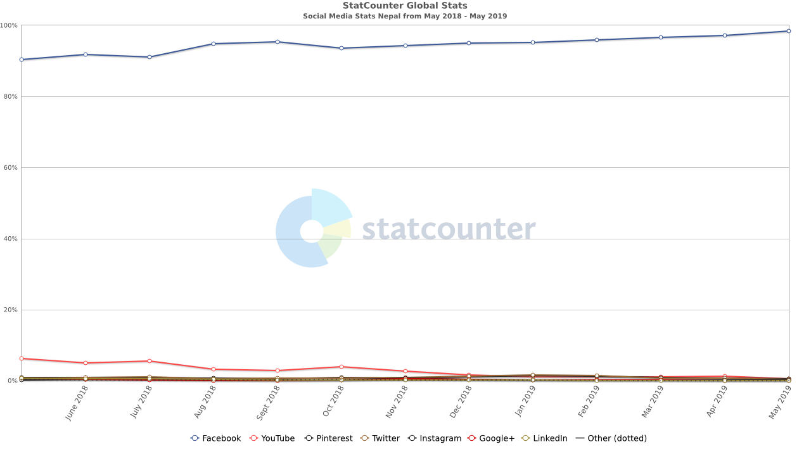
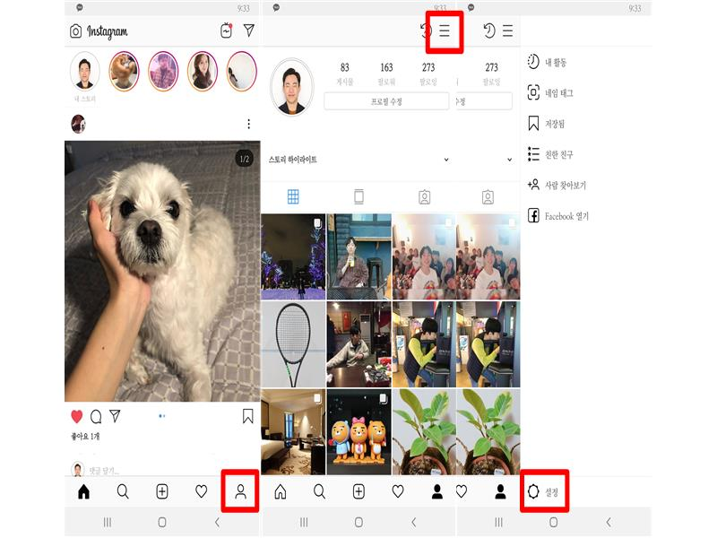
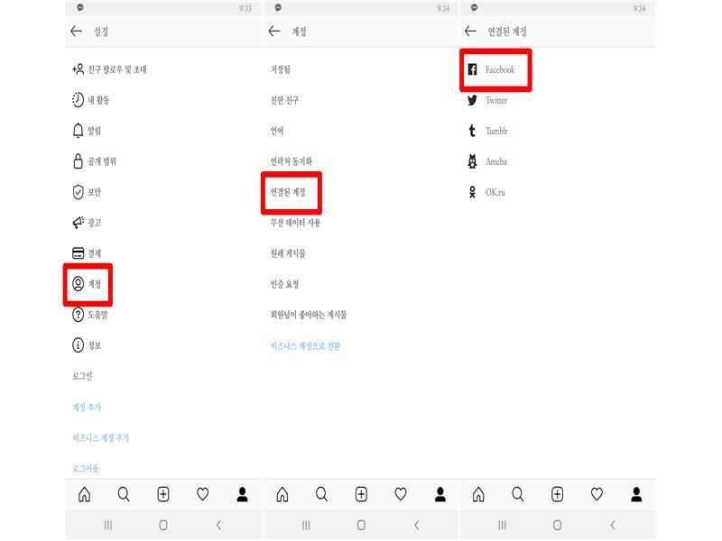
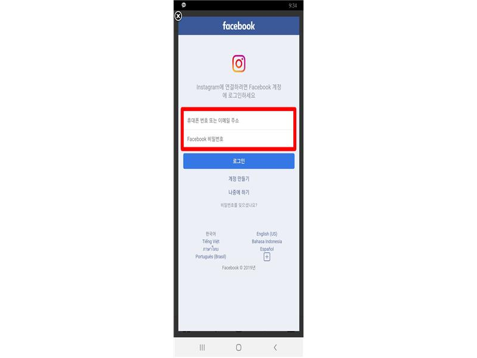

# Online Solution

**2019 SAMSUNG ONE WEEK NEPAL**

# 문서 작성 일정
- 업무 분담 (6/21)
- 1차 초안 작성 (6/28)
- MT (6/28)
- 교안 제출(7/12)

# Agenda
## 1st DAY

- Introduction (0.5 시간)
  - 본인 제품 intro (Template 제공)

- 나의 프로필 만들기 (1.5시간)
  - 자신의 로고 만드는 법 (모눈 종이, 색연필)
  - 영어 홍보  문구 만들기 (단어 카드 제작)

- 홍보에 좋은 앱 추천 (1장, 0.5시간)
  - 사진 보정, 로드 무비 만드는 법

- Reference site (inspiration) 추천 (0.5시간)

### 2nd DAY

- Social Media 활용 사례 (3 시간)
  - 공통 (0.5분)
    - 전략 - 1장 (강영애)
    - facebook과 instragram 연동하는 방법 (권문광):  Done
    - 제안: Flea Market 시작해서 커뮤니티 활성화 - 1개 : Done
            ex. 청년 시장, 5일 장을 만들고, 홍보를 SNS 통해...(최지수)
    - 카드 뉴스 (Best 5) - 전주시, 충주시 사례 (Community 중심) (박정재) : Done
  
  - Agriculture 2개 (이나리)

  - Industry 2개 (이존기, 김수정)
    - facebook 미용실 사례 추가

  - Tailoring 2개 (김태연, 장준영)

- 사례를 조사하되 현지에 맞게 교육
- 홍보를 할 제품을 가지고 와서 직접 사진, 로드 무비 만들어 보기(체험 및 공유)  
  

# Social Media Strategy 

## Stats

Source: http://gs.statcounter.com/social-media-stats/all/nepal

## How To Use Social Media for Marketing

1. 롤 모델을 찾고 그 운영 방식을 따라 해라.  
   롤 모델로 선정한 Social Media 페이지에 올라오는 글과 사진을 모방해서 올리는 것으로 Social Media 운영에 익숙해질 수 있다.

2. 처음에 페이스북으로 시작해라.  
   페이북에서 제품 홍보를 위한 비즈니스 페이지를 만들어라.

3. 그 다음에 다른 Social Media 활동을 넓혀라.  
   Instagram 또는  Twitter 로 확장한다.

4. 하루에 최소 하나씩은 올려라.  
   하루에 하나씩의 사진이라 글을 올려라

5. 있는 그대로의 현실을 담아라.  
   당신의 글과 사진에 생생함을 담아 올린다.

6. 사람들을 대화에 끌어들여라.  
   당신을 위한 의견을 질문으로 만들어서 올려라

7. 팔로어를 고색으로 바꿔라.  
   당신의 글에 가장 먼저 댓글을 단 다섯 명에게는 농산물을 할인 판매…

Source: https://brunch.co.kr/@rickeygo/5 (트위스트 앤 스프라우트 팜 을 운영하는  캐머론 포리 & 브리엘 포리 부부 이야기)

# Social Media BEST PRACTICE

## TIPS: Mobile Phone에서 Facebook과Instagram 연동 방법

> **Note**
> 영어 Screenshot 으로 변경

1. Sign in to Instagram

2. Select menu icon

   

3. Select **linked account** > **Facebook**

   

4. Sign in to Facebook

   

## What is Card News? [file](./online-solution-card-news.pdf)

정보를 간결한 글과 여러 장의 이미지로 압축해 전달하는 콘텐츠 형태이다. 대부분 10장 내외로 구성된다. ‘나열형’과 ‘스토리텔링형’으로 구분할 수 있다.

- 나열형: 각종 정보를 요약해서 보여줌
  ex) 맛집, 여행지, 팁 등 상업적 용도 많음
  https://www.dailian.co.kr/news/view/762662
  http://www.seouland.com/arti/culture/culture_general/5233.html

- 스토리텔링형: 자연스럽게 이야기하듯 콘텐츠를 전달함
  ex) 언론사에서 주로 이용 (사건 소개 등)
  https://news.naver.com/main/hotissue/read.nhn?mid=hot&sid1=110&cid=1010805&iid=5149123&oid=310&aid=0000073158&ptype=021
  https://news.naver.com/main/hotissue/read.nhn?mid=hot&sid1=110&cid=1010805&iid=5147409&oid=024&aid=0000061947&ptype=021

### 페이스북과 카드뉴스
1. 카드뉴스는 페이스북 페이지 콘텐츠 유형 중 가장 보편적인 형태로, 유저들에게 거부감 없이 다가갈 수 있다는 장점이 있다.

    - 매일 페이스북을 사용하는 사람 수: 15억 명 이상
    - 매달 페이스북을 사용하는 사람 수: 23억 명 이상
    - Facebook에서 활동 중인 광고주: 700만 명 이상
      --> 자료 출처: 페이스북

2. 카드뉴스는 모바일 이용자가 좋아하는 콘텐츠다. 소상공인 입장에서 소비자에게 다가가는 모바일 환경의 최적화된 언어다. (<카드뉴스 마케팅> p.35)

3. 카드뉴스 장점
    - 영상보다 제작하기 쉽고 텍스트보다 가독성이 좋음
    - 빠른 정보전달과 높은 접근성

4. 중소기업 페이스북 마케팅 성공사례
    - https://www.facebook.com/business/success/categories/small-business

## 플리 마켓 [file](./online-soulution-flea-market.pdf)

> **Note**
> PPT를 정리해서 최종 교안에 추가

## Agriculture 분야
### 매년 쌀 700톤 온라인 직거래로만 파는 농부의 비결 + 온라인 쇼핑몰 농산물 설명글에 레시피가 꼭 붙는 이유

1. 모든 SNS 수단을 활용해 나에 대해 알려라.  
    : 소비자와 정서적으로 교류하는 것이 중요

2. 소비자와 만날 수 있는 길을 뚫어라. ex) 체험활동  
    : 많은 사람들이 방문해야 해당 지역 농산물 소비 확률 증가

3. 상품 사진과 함께 어떻게 요리할 수 있는지 레시피를 첨부하라.  
    : 쉽고 간편한 요리법을 소개함으로써 해당 식재료가 낯선 소비자들까지 상품을 구매하도록 유도 가능
4. 30~49세 여성들을 타깃으로 먹거리 관련 홍보 컨텐츠를 작성하라.  
    : 30~49세 여성들의 경우 가정 내에서 식재료 선택권을 갖고 있는 경우가 높음

Source : https://brunch.co.kr/@rickeygo/3
        https://brunch.co.kr/@rickeygo/20

## Industry 분야

> **Note**
> 네팔 미용실 사례 정리

## Tailoring 분야

> **Note**
> 내용 정리
